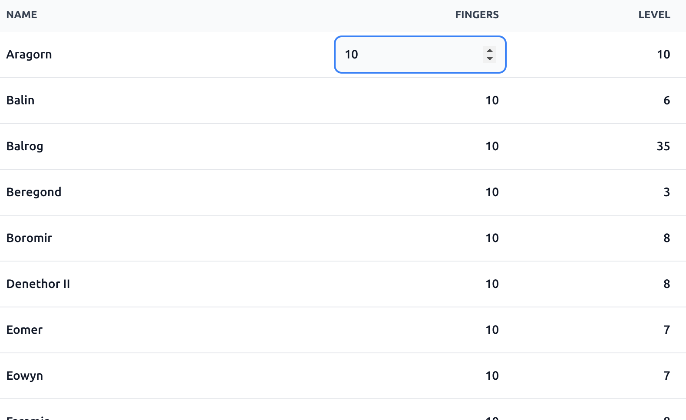
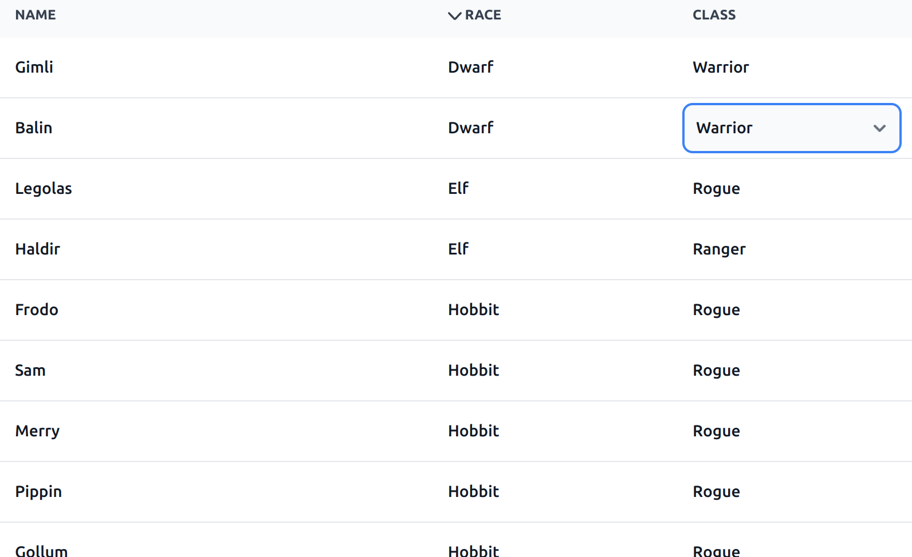
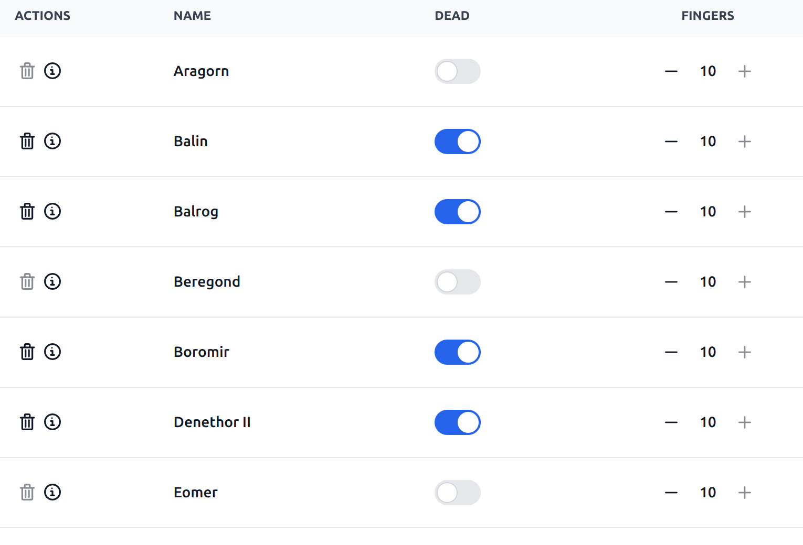
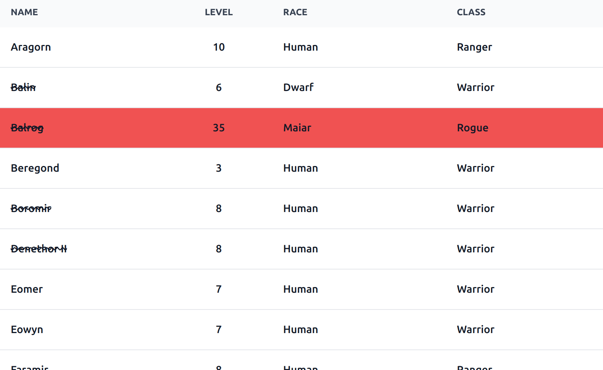

## Svelte Data Table based on [Flowbite Svelte](https://flowbite-svelte.com/), [Flowbite Icons](https://flowbite.com/icons/), and [Tailwind](https://tailwindcss.com/)

This data table is designed for viewing and editing data in an array of objects. It's built using the Flowbite Svelte library's Table components and works in conjunction with it, with support for custom cell editors, moving focus between cells with tab and enter, column sorting (simple and custom), conditional CSS, and more.

## Install

To add to an existing Svelte app, first install Tailwind if you haven't already:

```bash
> npx svelte-add@latest tailwindcss
```

Then install the Flowbite components and icons along with the data table component.
```bash
> npm i flowbite-svelte flowbite flowbite-svelte-icons @emamid/svelte-data-table
```

## Basic example

```html
<script lang="ts">
  import DataTable from '@emamid/svelte-data-table';
  import type { ColumnConfig } from '@emamid/svelte-data-table';

  const columns: ColumnConfig[] = [
    { canSort: true, key: 'firstName', title: 'First Name' },
    { canSort: true, key: 'lastName', title: 'Last Name' },
  ];

  const items: any[] = [
    { firstName: 'Bilbo', lastName: 'Baggins'},
    { firstName: 'Frodo', lastName: 'Baggins'},
    { firstName: 'Samwise', lastName: 'Gamgee'},
    { firstName: 'Meriadoc', lastName: 'Brandybuck'},
    { firstName: 'Peregrin', lastName: 'Took'},
  ];
</script>

<main>	
  <DataTable
    {columns}
    {items}
  />
</main>
```

Examples for most of the component's features are under /examples . You can find the documentation [here](https://emamid.github.io/svelte-data-table/).

#### Example 1 - Basic data table


#### Example 2 - Table with cell focus components


#### Example 3 - Table with cell focus Select components, cell renderers, and custom sort


#### Example 4 - Table with actions and cell view components


#### Example 5 - Table with custom cell component


#### Example 6 - Table with cell and row class getter functions


#### Kitchen Sink example - All of the above